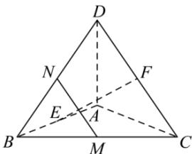

<!-- question-source:start -->
【43】（2024·全国高二专题练习）如图， $AD \perp AB$ ， $AD \perp AC$ ， $AB \perp AC$ ， $AB = AC = AD = 1$ ，E,F分别是AB,CD的中点，M,N分别是BC,BD的中点，用向量方法证明证明： $EF \perp MN$ .

<!-- question-source:end -->

![[Q00005354A1]]
