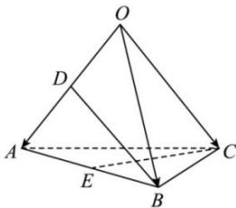

<!-- question-source:start -->
【44】(2023·上海高二期末)已知四面体 O-ABC 的各棱长均为 1, D 是棱 OA 的中点, E 是棱 AB 的中点, 设 $\overrightarrow{OA} = \vec{a}, \overrightarrow{OB} = \vec{b}, \overrightarrow{OC} = \vec{c}$ . 用空间向量方法判断 $\overrightarrow{BD}$ 与 $\overrightarrow{CE}$ 是否垂直.

<!-- question-source:end -->

![[Q00005355A1]]
