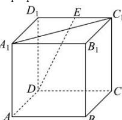

<!-- question-source:start -->
【47】（23-24·广东高二阶段练习）如图所示，在正方体 $ABCD-A_{1}B_{1}C_{1}D_{1}$ 中，E 为 $C_{1}D_{1}$ 的中点，则向量 $\overrightarrow{A_{1}C_{1}}$ 在向量 $\overrightarrow{DE}$ 上的投影向量是（）

A. $\frac{\sqrt{10}}{10}\overrightarrow{DE}$ B. $\frac{\sqrt{10}}{5}\overrightarrow{DE}$ C. $\frac{\sqrt{5}}{5}\overrightarrow{DE}$ D. $\frac{2}{5}\overrightarrow{DE}$
<!-- question-source:end -->

![[Q00005358A1]]
