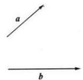
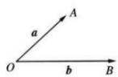

## (1) 夹角的定义

已知两个非零向量 a, b，在空间任取一点 O，作 $\overrightarrow{OA} = a, \overrightarrow{OB} = b$ ，则 $\angle AOB$ 叫做向量 a, b 的夹角，记作 $\langle a, b \rangle$ .

(2) 夹角的范围

空间任意两个向量的夹角的取值范围是 $0 \leqslant \langle a, b \rangle \leqslant \pi$ . 特别地, 当 $\langle a, b \rangle = 0$ 时, 两向量同向共线; 当 $\langle a, b \rangle = \pi$ 时, 两向量反向共线; 当 $\langle a, b \rangle = \frac{\pi}{2}$ 时, 两向量垂直, 记作 $a \perp b$ .
