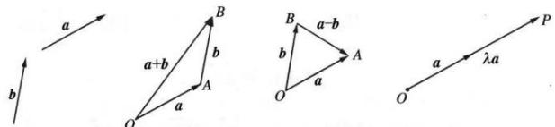

## 2. 空间向量的线性运算

（1）空间向量的加减法运算法则：

与平面向量的运算一样, 空间向量的加法、减法与数乘运算的意义为:

$$
\overrightarrow {O B} = \overrightarrow {O A} + \overrightarrow {A B} = \boldsymbol {a} + \boldsymbol {b}; \overrightarrow {B A} = \overrightarrow {O A} - \overrightarrow {O B} = \boldsymbol {a} - \boldsymbol {b}; \overrightarrow {O P} = \lambda \boldsymbol {a} (\lambda \in \mathbf {R})
$$

(2) 空间向量的加法运算满足交换律及结合律:

交换律: $a + b = b + a$ .

结合律: $(a+b)+c=a+(b+c)$ .

(3) $\lambda a$ 的方向和长度

当 $\lambda > 0$ 时, $\lambda a$ 与向量 $a$ 方向相同; 当 $\lambda < 0$ 时, $\lambda a$ 与向量 $a$ 方向相反. $\lambda a$ 的长度是 $a$ 的长度的 $|\lambda|$ 倍. 即 $|\lambda a| = |\lambda||a|$

(4) 空间向量的数乘运算满足分配律及结合律:

分配律： $\lambda (\pmb {a} + \pmb {b}) = \lambda \pmb {a} + \lambda \pmb{b}$

结合律： $\lambda(\mu\boldsymbol{a})=(\lambda\mu)\boldsymbol{a}$ . 其中 $\lambda,\mu\in R$ .
