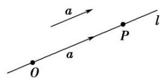

## 3. 共线向量

（1）定义:表示若干空间向量的有向线段所在的直线互相平行或重合,则这些向量叫做共线或平行向量.

(2) 共线向量定理: 对于空间任意两个向量 $a, b$ ( $b \neq 0$ ), $a // b$ 的充要条件是存在实数 $\lambda$ , 使 $a = \lambda b$ .

注意: 因为零向量与任意向量平行, 即对任意向量 a, 都有 $0 \parallel a$ . 所以共线定理中的 $b \neq 0$ 不可丢掉, 否则实数 $\lambda$ 不存在, 但依然有 $a \parallel b$ .

（3）方向向量:如图,O 是直线 l 上一点,在直线 l 上取非零向量 a,则对于直线 l 上任意一点 P,由数乘向量定义及向量共线的充要条件可知,存在实数 $\lambda$ ,使得 $\overrightarrow{OP} = \lambda a$ ,把与向量 a 平行的非零向量称为直线 l 的方向向量.直线 l 上任意一点都可以由直线 l 上一点和他的方向向量去表示.

