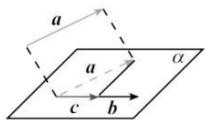
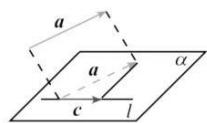
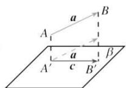

## 6. 向量的数量积

（1）定义: 已知两个非零向量 a, b，则 $\left|a\right|\left|b\right|\cos\langle a, b\rangle$ 叫做向量 a, b 的数量积，记作 $a \cdot b$ ，即 $a \cdot b = \left|a\right|\left|b\right|\cos\langle a, b\rangle$ .

规定:零向量与任何向量的数量积为 0.

(2) 投影向量

如图①, 在空间, 向量 a 向向量 b 投影由于它们是自由向量, 因此可以先将它们平移到同一个平面 $\alpha$ 内, 进而利用平面上向量的投影, 得到与向量 b 共线的向量 c, $c = |a| \cos \langle a, b \rangle \frac{b}{|b|}$ , 向量 c 称为向量 a 在向量 b 上的投影向量. 类似地, 可以将向量 a 向直线 l 投影（如图②）.

如图③, 向量 a 向平面 $\beta$ 投影, 就是分别由向量 a 的起点 A 和终点 B 作平面 $\beta$ 的垂线, 垂足分别为 $A'$ , $B'$ , 得到向量 $\overrightarrow{A'B'}$ , 向量 $\overrightarrow{A'B'}$ 称为向量 a 在平面 $\beta$ 上的投影向量. 这时, 向量 a, $\overrightarrow{A'B'}$ 的夹角就是向量 a 所在直线与平面 $\beta$ 所成的角.

(1)

(2)

(3)

（4）向量数量积的性质

①由 $a \cdot a = |a|^{2}$ 可得向量自身的数量积就是其模的平方.

② $a\cdot b=0$ 的充要条件是 $a\perp b(a,b$ 为非零向量）.

③两个非零向量 a, b 的夹角可由 a, b 的数量积表示: $\cos\langle a, b \rangle = \frac{a \cdot b}{|a| \cdot |b|}$ .

④对于任意向量a,b,总有 $|a\cdot b|\leqslant|a|\cdot|b|$ ，并且只有当a//b时，等号成立.

⑤ $\left|\boldsymbol{a}+\boldsymbol{b}\right|=\sqrt{\left(\boldsymbol{a}+\boldsymbol{b}\right)^{2}}=\sqrt{\boldsymbol{a}^{2}+2\boldsymbol{a}\cdot\boldsymbol{b}+\boldsymbol{b}^{2}}$

(5) 向量数量积的运算律

数乘结合律: $(\lambda\boldsymbol{a})\cdot\boldsymbol{b}=\lambda(\boldsymbol{a}\cdot\boldsymbol{b});$

交换律: $a \cdot b = b \cdot a$ ;

分配律： $\boldsymbol{a}\cdot(\boldsymbol{b}+\boldsymbol{c})=\boldsymbol{a}\cdot\boldsymbol{b}+\boldsymbol{a}\cdot\boldsymbol{c}.$
