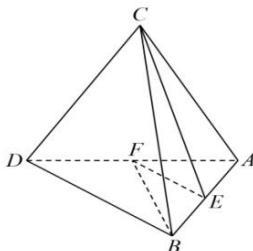

<!-- question-source:start -->
【10】(2022·全国高二课后作业) 如图所示, 已知空间四边形 $ABDC$ 的对角线和每条边长都等于 1, 点 $E$ 、 $F$ 分别是 $AB$ 、 $AD$ 的中点. 计算:

(1) $\overrightarrow{EF} \cdot \overrightarrow{BA}$ ;
(2) $\overrightarrow{EF} \cdot \overrightarrow{BD}$ ;
(3) $\overrightarrow{EF} \cdot \overrightarrow{DC}$ ;
(4) $\overrightarrow{BF} \cdot \overrightarrow{CE}$ .
<!-- question-source:end -->

![[Q00005621A1]]
