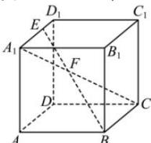

> [!faq]- 全练一本通解析
> **【答案】** D
>
> **【解析】**
> 证明见解析
> 解析：连接 EF，FB，
> ∵ $\overrightarrow{EF}=\overrightarrow{A_{1}F}-\overrightarrow{A_{1}E}=\frac{2}{5}\overrightarrow{A_{1}C}-\frac{2}{3}\overrightarrow{A_{1}D_{1}}$ $=\frac{2}{5}\left(\overrightarrow{A_{1}A}+\overrightarrow{AB}+\overrightarrow{BC}\right)-\frac{2}{3}\overrightarrow{A_{1}D_{1}}$ $=\frac{2}{5}\left(\overrightarrow{A_{1}B_{1}}+\overrightarrow{A_{1}D_{1}}+\overrightarrow{A_{1}A}\right)-\frac{2}{3}\overrightarrow{A_{1}D_{1}}$ $=\frac{2}{5}\overrightarrow{A_{1}B_{1}}+\frac{2}{5}\overrightarrow{A_{1}A}-\frac{4}{15}\overrightarrow{A_{1}D_{1}}$ $\overrightarrow{FB}=\overrightarrow{A_{1}B}-\overrightarrow{A_{1}F}=\overrightarrow{A_{1}B_{1}}+\overrightarrow{A_{1}A}-\frac{2}{5}\left(\overrightarrow{A_{1}B_{1}}+\overrightarrow{A_{1}D_{1}}+\overrightarrow{A_{1}A}\right)$ $=\frac {3}{5}\overrightarrow {A _ { 1 } B _ { 1 } } + \frac {3}{5}\overrightarrow {A _ { 1 } A } - \frac {2}{5}\overrightarrow {A _ { 1 } D _ { 1 }}$ ∴ $\overrightarrow {EF}= \frac {2}{3}\overrightarrow {F B}, \therefore \overrightarrow {E F}//\overrightarrow {F B},$ 又 $EF\cap FB=F,\therefore E,F,B$ 三点共线.
> 
> 解析: 空间向量共面定理: $\overrightarrow{OM} = x\overrightarrow{OA} + y\overrightarrow{OB} + z\overrightarrow{OC}$ ，若 A, B, C 不共线，且 A, B, C, M 共面，其充要条件是 $x + y + z = 1$ .
> 对 A, 因为 $1-1-1 \neq 1$ ，所以 A, B, C, M 四点不共面；
> 对 B, 因为 $\frac{1}{5}+\frac{1}{3}+\frac{1}{2}=\frac{31}{30}\neq1$ ，所以 A, B, C, M 四点不共面；
> 对 C, 由 $\overrightarrow{OM} + \overrightarrow{OA} + \overrightarrow{OB} + \overrightarrow{OC} = \vec{0}$ 可得 $\overrightarrow{OM} = -\overrightarrow{OA} - \overrightarrow{OB} - \overrightarrow{OC}$ 因为 $-1-1-1=-3\neq1$ ，所以 A, B, C, M 四点不共面；
> 对 D, 由 $\overrightarrow{MA} + \overrightarrow{MB} + \overrightarrow{MC} = \vec{0}$ 可得 $\overrightarrow{OA} - \overrightarrow{OM} + \overrightarrow{OB} - \overrightarrow{OM} + \overrightarrow{OC} - \overrightarrow{OM} = \vec{0}$
> 即 $\overrightarrow{OM}=\frac{1}{3}\overrightarrow{OA}+\frac{1}{3}\overrightarrow{OB}+\frac{1}{3}\overrightarrow{OC}$ ，因为 $\frac{1}{3}+\frac{1}{3}+\frac{1}{3}=1$ ，所以 A, B, C, M 四点共面。
>
> 故选 **D**
