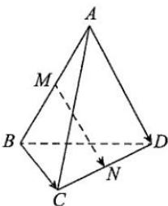

<!-- question-source:start -->
【23】（19-20·全国高二课后作业）如图所示，M、N分别是空间四边形ABCD的边AB、CD的中点.试判断并证明向量 $\overrightarrow{MN}$ 与向量 $\overrightarrow{AD}$ 、 $\overrightarrow{BC}$ 是否共面.

<!-- question-source:end -->

![[Q00005334A1]]
