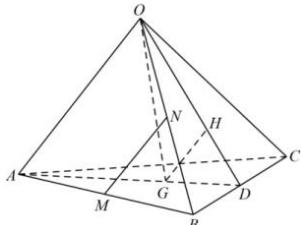

<!-- question-source:start -->
【25】（2023·全国高二随堂练习）如图所示，四面体 $O - ABC$ 中， $G, H$ 分别是 $\triangle ABC, \triangle OBC$ 的重心，设 $\overrightarrow{OA} = \vec{a}, \overrightarrow{OB} = \vec{b}, \overrightarrow{OC} = \vec{c}$ ，点 $D, M, N$ 分别为 $BC, AB, OB$ 的中点.

（1）试用向量 $\vec{a}, \vec{b}, \vec{c}$ 表示向量 $\overrightarrow{MN}, \overrightarrow{OG}$ ;
（2）试用空间向量的方法证明 MNGH 四点共面.
<!-- question-source:end -->

![[Q00005622A1]]
