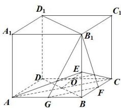

> [!faq]- 全练一本通解析
> **【答案】** $\frac{6}{5}$
>
> **【解析】**
> 如图所示,
> 
> 正方体 $ABCD - A_1B_1C_1D_1$ 中， $\overline{BE} = \frac{3}{4}\overline{BB_1},\overline{BF} = \frac{1}{2}\overline{BC},\overline{BG} = \frac{1}{2}\overline{BA}$ ， $\overrightarrow{BO} = x\overrightarrow{BG} +y\overrightarrow{BF} +z\overrightarrow{BE} = \frac{1}{2} x\overrightarrow{BA} +\frac{1}{2} y\overrightarrow{BC} +z\overrightarrow{BE} = x\overrightarrow{BG} +y\overrightarrow{BF} +\frac{3}{4} z\overline{BB_1}$ ， $\because O,A,C,E$ 四点共面， $O,G,F,B_{1}$ 四点共面，
> ∴ $\left\{\begin{aligned}\frac{1}{2}x+\frac{1}{2}y+z=1\\ x+y+\frac{3}{4}z=1\end{aligned}\right.$ ，解得 $x+y=\frac{2}{5}$ ， $z=\frac{4}{5}$ ；∴ $x+y+z=\frac{6}{5}$ 。故答案为： $\frac{6}{5}$
