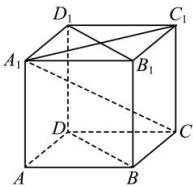

<!-- question-source:start -->
【45】如图, 在棱长为 1 的正方体 $ABCD - A_{1}B_{1}C_{1}D_{1}$ 中, 向量 $\overrightarrow{AB}$ 在向量 $\overrightarrow{A_{1}C_{1}}$ 上的投影向量是 \_\_\_\_, 向量 $\overrightarrow{AB}$ 在直线 $A_{1}C$ 上的投影向量是 \_\_\_\_, 向量 $\overrightarrow{AB}$ 在平面 $BDD_{1}B_{1}$ 上的投影向量是 \_\_\_\_.

<!-- question-source:end -->

![[Q00005356A1]]
