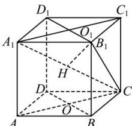

> [!faq]- 全练一本通解析
> **【答案】** $\frac{1}{2}\overline{A_1C_1}$ 和 $\frac{1}{3}\overline{A_1C}$ 和 $\frac{1}{2}\overline{DB}$ （答案不唯一）
>
> **【解析】**
> （1）方法一：在正方体 $ABCD - A_1B_1C_1D_1$ 中，易知 $AB // A_1B_1$ ， $\angle C_1A_1B_1 = 45^\circ$ 向量 $\overrightarrow{AB}$ 与向量 $\overrightarrow{A_1C_1}$ 夹角为 $45^\circ$ ， $\left|\overrightarrow{AB}\right| = 1$ ， $\left|\overrightarrow{A_1C_1}\right| = \sqrt{\left|\overrightarrow{A_1B_1}\right|^2 + \left|\overrightarrow{B_1C_1}\right|^2} = \sqrt{2}$ 所以向量 $\overrightarrow{AB}$ 在向量 $\overrightarrow{A_1C_1}$ 上的投影向量是 $\left|\overrightarrow{AB}\right| \cdot \cos \left\langle \overrightarrow{AB},\overrightarrow{A_1C_1}\right\rangle \cdot \frac{\overrightarrow{A_1C_1}}{\left|\overrightarrow{A_1C_1}\right|} = 1\times \frac{\sqrt{2}}{2}\times \frac{\overrightarrow{A_1C_1}}{\sqrt{2}} = \frac{1}{2}\overrightarrow{A_1C_1}$ 方法二：设 $B_{1}D_{1}\cap A_{1}C_{1} = O_{1}$ ，如图，由正方体的性质可得
> $AB / / A_{1}B_{1}$ ， $AB = A_{1}B_{1}$ ， $B_{1}O_{1}\bot A_{1}C_{1}$ 向量 $\overline{AB}$ 在向量 $\overline{A_1C_1}$ 上的投影向量是 $\overline{A_1O_1} = \frac{1}{2}\overline{A_1C_1}$ （2）如图，连接 $B_{1}C$ ，过 $B_{1}$ 作 $B_{1}H\bot A_{1}C$ ，垂足为 $H$ ，则 $\overline{AB}$ 在直线 $A_{1}C$ 上的投影向量就是 $\overline{A_1H}$ 在正方体 $ABCD - A_1B_1C_1D_1$ 中，易知 $A_{1}B_{1}\bot$ 平面 $BCC_{1}B_{1}$ ，因为 $B_{1}C\subset$ 平面 $BCC_{1}B_{1}$ ，所以 $A_{1}B_{1}\bot B_{1}C$ 在 Rt△ $A_{1}B_{1}C$ 中， $A_{1}B_{1} = 1$ ， $B_{1}C = \sqrt{2}$ ， $A_{1}C = \sqrt{3}$ ， $\cos \angle B_1A_1C = \frac{\sqrt{3}}{3},$ $A_{1}H = A_{1}B_{1}\cdot \cos \angle B_{1}A_{1}C = \frac{\sqrt{3}}{3} = \frac{1}{3} A_{1}C.$ 所以向量 $\overline{AB}$ 在直线 $A_{1}C$ 上的投影向量是 $\frac{1}{3}\overline{A_1C}$ （3）如图，连接 $AC,$ 交 $BD$ 于点 $O$ ，易证 $AC\bot BD$ ， $AC\bot BB_{1}$ 由 $BB_{1}\cap BD = B$ ， $BB_{1},BD\subset$ 平面 $BDD_{1}B_{1}$ ，则 $AC\bot$ 平面 $BDD_{1}B_{1}$ 所以 $\overline{AB}$ 在平面 $BDD_{1}B_{1}$ 上的投影向量就是 $\overline{OB}$ ，易知 $\overline{OB} = \frac{1}{2}\overline{DB}$
> 
> 故答案为： $\frac{1}{2}\overline{A_{1}C_{1}}$ ； $\frac{1}{3}\overline{A_{1}C}$ ； $\frac{1}{2}\overline{DB}$ （答案不唯一）
