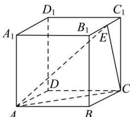

<!-- question-source:start -->
【56】(2021·全国高二)已知正方体 $ABCD-A_{1}B_{1}C_{1}D_{1}$ 的棱长为 1, E 为棱 $B_{1}C_{1}$ 上的动点. 求向量 $\overrightarrow{AE}$ 在向量 $\overrightarrow{AC}$ 方向上投影的数量的取值范围.

<!-- question-source:end -->

![[Q00005367A1]]
