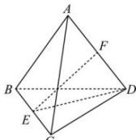

> [!faq]- 全练一本通解析
> **【答案】** D
>
> **【解析】**
> 解析:分别取BC,AD的中点E,F,则 $\left|\overrightarrow{PB}+\overrightarrow{PC}\right|=\left|2\overrightarrow{PE}\right|=2\sqrt{2}$ 所以 $\left|\overrightarrow{PE}\right|=\sqrt{2}$ 故点P的轨迹是以E为球心，以 $\sqrt{2}$ 为半径的球
> 面， $\overrightarrow{AP}\cdot\overrightarrow{PD}=-(\overrightarrow{PF}+\overrightarrow{FA})\cdot(\overrightarrow{PF}+\overrightarrow{FD})=-(\overrightarrow{PF}+\overrightarrow{FA})\cdot(\overrightarrow{PF}-\overrightarrow{FA})=|\overrightarrow{FA}|^{2}-|\overrightarrow{PF}|^{2}=4-\left|\overrightarrow{PF}\right|^{2}$ 又 $ED=\sqrt{DC^{2}-CE^{2}}=\sqrt{16-4}=\sqrt{12}=2\sqrt{3}$ $EF=\sqrt{DE^{2}-DF^{2}}=\sqrt{12-4}=\sqrt{8}=2\sqrt{2}$ 所以 $\left|\overrightarrow{PF}\right|_{\min}=EF-\sqrt{2}=\sqrt{2},\left|\overrightarrow{PF}\right|_{\max}=EF+\sqrt{2}=3\sqrt{2}$ 所以 $\overrightarrow{AP}\cdot\overrightarrow{PD}$ 的取值范围为 $[-14,2]$ . 故选:D.
> 
