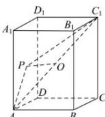

> [!faq]- 全练一本通解析
> **【答案】** B
>
> **【解析】**
> 解析: 取 $AC_{1}$ 中点 O，
> 
> 则 $\overrightarrow{PA}\cdot\overrightarrow{PC_{1}}=\left(\overrightarrow{PO}+\overrightarrow{OA}\right)\cdot\left(\overrightarrow{PO}+\overrightarrow{OC_{1}}\right)=\left(\overrightarrow{PO}+\overrightarrow{OA}\right)\cdot\left(\overrightarrow{PO}-\overrightarrow{OA}\right)=\overrightarrow{PO}^{2}-\overrightarrow{OA}^{2}$ ∵ 当 P 为侧面 $ABB_{1}A_{1}$ 中点时， $\left|\overrightarrow{PO}\right|_{\min}=\frac{1}{2}$ ; PO 的最大值为体对角线的一半 1，又 $\left|\overrightarrow{OA}\right|=\frac{1}{2}\left|\overrightarrow{AC_{1}}\right|=\frac{1}{2}\sqrt{1+1+2}=1$ ， $\therefore\left(\overrightarrow{PO}^{2}-\overrightarrow{OA}^{2}\right)\in\left[-\frac{3}{4},0\right]$ ，
> 即 $\overrightarrow{PA}\cdot\overrightarrow{PC_{1}}$ 的取值范围为 $\left[-\frac{3}{4},0\right]$ .
>
> 故选 **B**.
