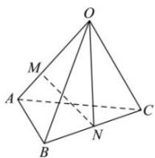

> [!faq]- 全练一本通解析
> **【答案】** B
>
> **【解析】**
> 解析：∵点M在线段OA上，且OM=2MA，N为BC中点，
> ∴ $\overrightarrow{OM}=\frac{2}{3}\overrightarrow{OA}$ ， $\overrightarrow{ON}=\frac{1}{2}(\overrightarrow{OB}+\overrightarrow{OC})=\frac{1}{2}\overrightarrow{OB}+\frac{1}{2}\overrightarrow{OC}$ ∴ $\overrightarrow{MN} = \overrightarrow{ON} - \overrightarrow{OM} = \frac{1}{2} \overrightarrow{OB} + \frac{1}{2} \overrightarrow{OC} - \frac{2}{3} \overrightarrow{OA} = -\frac{2}{3} \vec{a} + \frac{1}{2} \vec{b} + \frac{1}{2} \vec{c}$
> 
>
> 故选 **B**.
