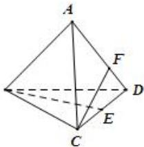

<!-- question-source:start -->
【11】(2023·全国高二专题练习)如图,各棱长都为2的四面体ABCD中 $\overrightarrow{CE}=\overrightarrow{ED},\overrightarrow{AF}=2\overrightarrow{FD}$ ，则向量 $\overrightarrow{BE}\cdot\overrightarrow{CF}=$ （）

B

A. $-\frac{1}{3}$ B. $\frac{1}{3}$ C. $-\frac{1}{2}$ D. $\frac{1}{2}$
<!-- question-source:end -->

![[Q00005322A1]]
