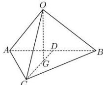

> [!faq]- 全练一本通解析
> **【答案】** AC
>
> **【解析】**
> 解析:如图, D 为 AB 的中点, 则点 G 在 CD 上, 且 $CG = \frac{2}{3} CD$ ,
> 则 $\overrightarrow{OG}=\overrightarrow{OC}+\overrightarrow{CG}=\overrightarrow{OC}+\frac{2}{3}\overrightarrow{CD}=\overrightarrow{OC}+\frac{2}{3}\times\frac{1}{2}\left(\overrightarrow{CA}+\overrightarrow{CB}\right)$ $=\overrightarrow{OC}+\frac{1}{3}\left(\overrightarrow{OA}-\overrightarrow{OC}+\overrightarrow{OB}-\overrightarrow{OC}\right)=\frac{1}{3}\left(\overrightarrow{OA}+\overrightarrow{OB}+\overrightarrow{OC}\right)$ ,
> 则 $\overrightarrow{OG}\cdot\left(\overrightarrow{OA}+\overrightarrow{OB}+\overrightarrow{OC}\right)=\frac{1}{3}\left(\overrightarrow{OA}+\overrightarrow{OB}+\overrightarrow{OC}\right)\cdot\left(\overrightarrow{OA}+\overrightarrow{OB}+\overrightarrow{OC}\right)$ $=\frac{1}{3}\left(\overrightarrow{OA}^{2}+\overrightarrow{OB}^{2}+\overrightarrow{OC}^{2}+2\overrightarrow{OA}\cdot\overrightarrow{OB}+2\overrightarrow{OA}\cdot\overrightarrow{OC}+2\overrightarrow{OC}\cdot\overrightarrow{OB}\right)$ $=\frac{1}{3}(1+4+9+0+0+0)=\frac{14}{3}$ . 故选:D.
> 
> 解析: 在空间四边形 ABCD 中, $\overrightarrow{AB}, \overrightarrow{AC}$ 夹角为 $60^{\circ}$ , 所以 $2\overrightarrow{AB}\cdot\overrightarrow{AC}=2\times\left|\overrightarrow{AB}\right|\times\left|\overrightarrow{AC}\right|\cos60^{\circ}=a^{2}$ . 故 A 正确; $\overrightarrow{AD},\overrightarrow{DB}$ 夹角为 $120^{\circ}$ ，所以 $2\overrightarrow{AD}\cdot\overrightarrow{DB}=2\times\left|\overrightarrow{AD}\right|\times\left|\overrightarrow{DB}\right|\cos120^{\circ}=-a^{2}$ .
> 故 B 错误；
> 因为点 F, G 分别是 AD, DC 的中点, 所以 FG // AC 且 $\left|FG\right|=\frac{1}{2}\left|AC\right|$ , 所以 $\overrightarrow{AC}, \overrightarrow{FG}$ 夹角为 $0^{\circ}$ , 所以 $2\overrightarrow{FG}\cdot\overrightarrow{AC}=2\times\left|\overrightarrow{FG}\right|\times\left|\overrightarrow{AC}\right|\cos0^{\circ}=a^{2}$ . 故 C 正确;
> 因为点 E, F 分别是 AB, AD 的中点, 所以 EF // BD, 所以 $\overrightarrow{EF}, \overrightarrow{CB}$ 夹角为 $120^{\circ}$ , 所以 $2\overrightarrow{EF}\cdot\overrightarrow{CB}=2\times\left|\overrightarrow{EF}\right|\times\left|\overrightarrow{CB}\right|\cos120^{\circ}=-\frac{1}{2}a^{2}$ . 故 D 错误. 故选: AC
> ## 重点题型专练
