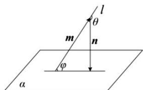
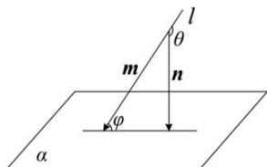

## 2. 向量法求直线与平面所成角

如图所示, 设直线 l 的方向向量为 $\vec{m}$ , 平面 $\alpha$ 的法向量为 $\vec{n}$ , 直线 l 与平面 $\alpha$ 所成的角为 $\varphi$ , 两向量 $\vec{m}$ 与 $\vec{n}$ 的夹角为 $\theta$ , 则有 $\varphi = \theta - \frac{\pi}{2}$ 或 $\varphi = \frac{\pi}{2} - \theta$ , 所以 $\cos\varphi = \sin\theta, \sin\varphi = |\cos\theta| = \frac{|\vec{m} \cdot \vec{n}|}{|\vec{m}||\vec{n}|}$

