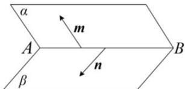
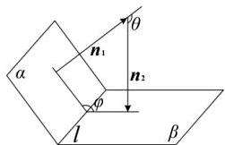
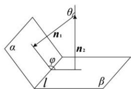
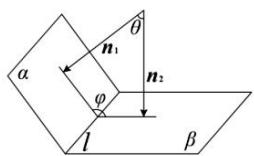
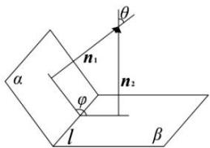

## 3. 向量法求平面与平面所成角

（1）在两个半平面内找与棱垂直的直线的方向向量，求出其夹角．如图所示， $\langle\overrightarrow{m},\overrightarrow{n}\rangle$ 即为所求二面角的平面角.

（2）对于易于建立空间直角坐标系的几何体, 求二面角的大小时, 可以用这两个平面的法向量的夹角来求. 如图所示, 二面角 $\alpha - l - \beta$ , 平面 $\alpha$ 的法向量为 $\overrightarrow{n_1}$ , 平面 $\beta$ 的法向量为 $\overrightarrow{n_2}$ , $\left\langle \overrightarrow{n_1}, \overrightarrow{n_2} \right\rangle = \theta$ , 则二面角 $\alpha - l - \beta$ 的大小为 $\theta$ 或 $\pi - \theta$ . 则二面角大小为 $\left|\cos \left\langle \overrightarrow{n_1}, \overrightarrow{n_2} \right\rangle\right| = \left|\frac{\overrightarrow{n_1} \cdot \overrightarrow{n_2}}{\left|\overrightarrow{n_1}\right|\left|\overrightarrow{n_2}\right|}\right| = \frac{\left|\overrightarrow{n_1} \cdot \overrightarrow{n_2}\right|}{\left|\overrightarrow{n_1}\right|\left|\overrightarrow{n_2}\right|}$ .

注意:在利用向量法求二面角时,一定要结合图形判断出二面角是锐二面角还是钝二面角.

