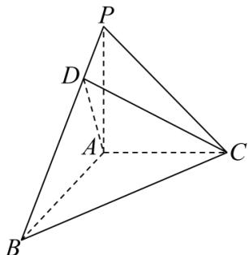

<!-- question-source:start -->
【4】（2023·全国高三专题练习）如图所示，在三棱锥 P-ABC 中，三条棱 AP, AB, AC 两两互相垂直， $\angle PBA=\frac{\pi}{6}$ ，点 D 满足 $\overrightarrow{PB}=4\overrightarrow{PD}$ 。若 AP=AC，求异面直线 CD 与 AB 所成角的余弦值。

<!-- question-source:end -->

![[Q00005557A1]]
