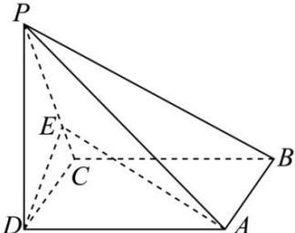

<!-- question-source:start -->
【12】（2023·全国高三专题）如图, 四棱锥 P-ABCD 中, 底面 ABCD 为矩形, AD=PD=2CD=2, PB=3, 点 E 为棱 PC 上的点, 且 BC⊥DE. 若 PE=2CE, 求直线 DE 与平面 PBC 所成角的正弦值.

<!-- question-source:end -->

![[Q00005565A1]]
