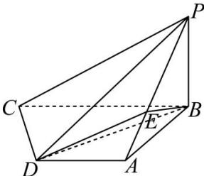

<!-- question-source:start -->
【17】（2024·河北保定高二期中）如图, 在四棱锥 P-ABCD 中, $PB \perp$ 底面 ABCD, $CD \perp PD$ , 底面 ABCD 为直角梯形, $AD // BC$ , AB = AD = PB = 1, $AB \perp BC$ , 点 E 在棱 PA 上, 且 PE = 2EA.

(1) 证明: PC // 平面 EBD;

(2) 求直线 PD 与平面 EBD 所成角的余弦值.

<!-- question-source:end -->

![[Q00005648A1]]
