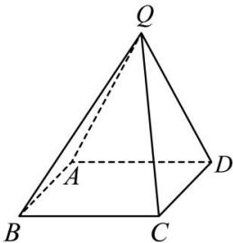

<!-- question-source:start -->
【18】（2023·四川成都高二期末）如图所示，在四棱锥 Q-ABCD 中，底面 ABCD 是矩形，若 $QC=\sqrt{5}$ ，CD=1, AD=QD=QA=2.
（1）证明：平面 $QAD \perp$ 平面 ABCD；
（2）若 E, F 分别是 QC, QD 的中点, 动点 P 在线段 EF 上移动, 设 $\theta$ 为直线 BP 与平面 ABCD 所成角, 求 $\sin\theta$ 的取值范围.

<!-- question-source:end -->

![[Q00005649A1]]
