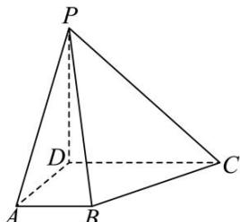

<!-- question-source:start -->
【22】（2024·吉林高二）如图, 在四棱锥 P-ABCD 中, 平面 $PAD \perp$ 平面 ABCD, $AD \perp DP$ , $AB \parallel CD$ , $\angle ADC = 90^{\circ}$ . 且 AD = CD = PD = 2AB = 2.

(1)求证： $AB\perp$ 平面PAD；
(2)求二面角 $A - PB - C$ 的余弦值.
<!-- question-source:end -->

![[Q00005652A1]]
