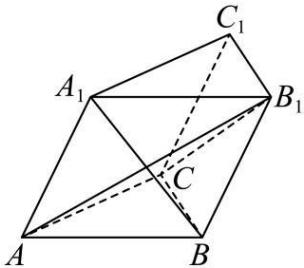

<!-- question-source:start -->
【26】（2024·黑龙江齐齐哈尔三模）如图，在三棱柱 $ABC-A_{1}B_{1}C_{1}$ 中，平面 $AA_{1}C_{1}C\perp$ 平面ABC， $A_{1}B=\sqrt{6}$ ，AB=AC=BC= $AA_{1}=2$ 。
（1）证明： $AC \perp A_{1}B$ ;
（2）求二面角 $A - CB_{1} - B$ 的正弦值.

<!-- question-source:end -->

![[Q00005656A1]]
