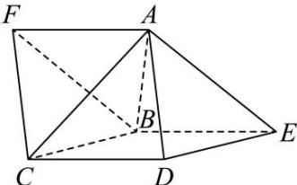

<!-- question-source:start -->
【28】(24-25高三·河北邯郸·开学考试)如图,已知正四面体 $F - ABC$ 的底面与正四棱锥 $A - BCDE$ 的一个侧面重合.

(1)求证： $AF \perp DE$ ；

(2)求二面角 F - BC - D 的余弦值.
<!-- question-source:end -->

![[Q00005658A1]]
