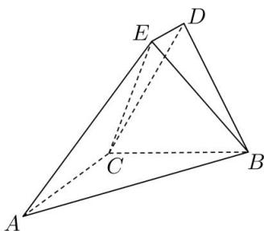

<!-- question-source:start -->
【30】（2023·辽宁高三期中）如图所示，在五面体 $ABCDE$ 中， $AC \perp$ 平面 $BCD, ED \parallel AC$ ，且 $DB = DC$ ， $AC = BC = 2ED = 2$ ．
（1）求证：平面 $ABE \perp$ 平面 $ABC$ ；
（2）求二面角 $A-BE-C$ 的平面角的取值范围.

<!-- question-source:end -->

![[Q00005660A1]]
