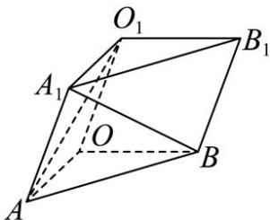
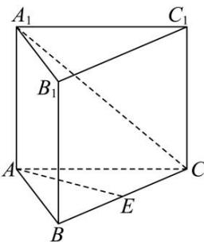

<!-- question-source:start -->
【2】如图, 三棱柱 $OAB - O_1A_1B_1$ 中, 平面 $OBB_1O_1 \perp$ 平面 $OAB$ , $\angle O_1OB = 60^\circ$ , $\angle AOB = 90^\circ$ , $OB = OO_1 = 2$ , $OA = \sqrt{3}$ , 求异面直线 $A_1B$ 与 $O_1A$ 所成角的余弦值.

<!-- question-source:end -->

![[Q00005555A1]]
