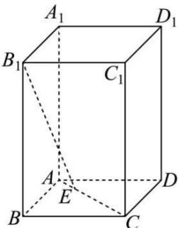
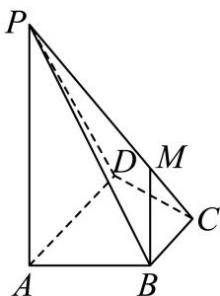

<!-- question-source:start -->
【8】（2024·广东惠州高二练习）如图，在直四棱柱 $ABCD - A_{1}B_{1}C_{1}D_{1}$ 中，底面ABCD是正方形， $AB = 2$ $AA_{1} = 3$ ，线段AC上有一动点E.求直线 $B_{1}E$ 与 $CC_{1}$ 所成角的余弦值的取值范围.

<!-- question-source:end -->

![[Q00005561A1]]
