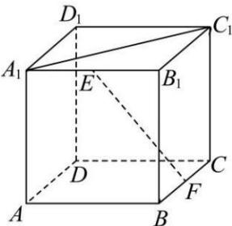

<!-- question-source:start -->
【10】(2024·天津南开高三上期末)如图,在正方体 $ABCD-A_{1}B_{1}C_{1}D_{1}$ 中,E为棱 $A_{1}B_{1}$ 上一点（不含端点）,F为棱BC的中点,求直线EF与 $A_{1}C_{1}$ 所成角余弦值的取值范围.

<!-- question-source:end -->

![[Q00005563A1]]
