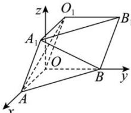

> [!faq]- 全练一本通解析
> **【答案】** $\frac{1}{7}$
>
> **【解析】**
> 以 $O$ 为坐标原点， $OA,OB$ 所在直线分别为 $x$ 轴、 $y$ 轴，建立如图所示的空间直角坐标系，
> 
> 则 $A(\sqrt{3},0,0),B(0,2,0),A_{1}(\sqrt{3},1,\sqrt{3}),O_{1}(0,1,\sqrt{3})$ 所以 $\overrightarrow{A_{1}B}=(-\sqrt{3},1,-\sqrt{3}),\overrightarrow{O_{1}A}=(\sqrt{3},-1,-\sqrt{3})$ 设所求的角为 $\alpha$ 则 $\cos\alpha=\frac{|\overrightarrow{A_{1}B}\cdot\overrightarrow{O_{1}A}|}{|A_{1}B||O_{1}A|}=\frac{|-3-1+3|}{\sqrt{7}\times\sqrt{7}}=\frac{1}{7}$ 即异面直线 $A_{1}B$ 与 $O_{1}A$ 所成角的余弦值为 $\frac{1}{7}$
