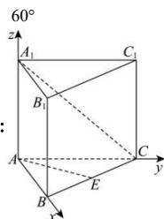
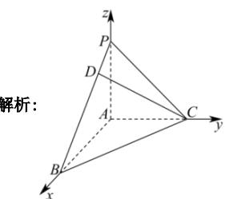

> [!faq]- 全练一本通解析
> **【答案】** $60^{\circ}$
>
> **【解析】**
> 
> 如图, 建立以 A 为坐标原点, AB, AC, $AA_{1}$ 分别为 x, y, z 轴的空间直角坐标系,
> 则 $A(0,0,0)$ , $B(2,0,0)$ , $C(0,2,0)$ , $E(1,1,0)$ , $A_{1}(0,0,2)$ , $\overline{AE}=(1,1,0)$ , $\overline{A_{1}C}=(0,2,-2)$ ,
> 设异面直线 AE 与 $A_{1}C$ 所成的角为 $\theta$ ，则 $\cos\theta=\frac{\left|\overrightarrow{AE}\cdot\overrightarrow{A_{1}C}\right|}{\left|\overrightarrow{AE}\right|\left|\overrightarrow{A_{1}C}\right|}=\frac{2}{\sqrt{2}\times2\sqrt{2}}=\frac{1}{2}$ 所以 $\theta=60^{\circ}$ ，即异面直线 AE 与 $A_{1}C$ 所成的角为 $60^{\circ}$
> $$
> \frac {\sqrt {2 1}}{1 4}
> $$
> 解析：
> 
> ∵ 三棱锥 P-ABC 中的三条棱 AP, AB, AC 两两互相垂直，
> ∴ 以 A 为原点，分别以 AB, AC, AP 所在的直线为 x 轴，y 轴，z 轴，建立如图所示的空间直角坐标系，
> 设 AP = AC = a ，因为 $\angle PBA = \frac{\pi}{6}$ ，则 $AB = \sqrt{3}a$ ， $C(0,a,0)$ ， $P(0,0,a)$ ， $B(\sqrt{3}a,0,0)$ ， $\overrightarrow{PB} = (\sqrt{3}a,0,-a)$ ， $\overrightarrow{AP} = (0,0,a)$ ， $\overrightarrow{AD}=\overrightarrow{AP}+\overrightarrow{PD}=\overrightarrow{AP}+\frac{1}{4}\overrightarrow{PB}=(0,0,a)+\frac{1}{4}(\sqrt{3}a,0,-a)=(\frac{\sqrt{3}a}{4},0,\frac{3a}{4})$ $\because A(0,0,0),\therefore D\left(\frac{\sqrt{3}}{4}a,0,\frac{3}{4}a\right),$ $\overrightarrow{CD}=\left(\frac{\sqrt{3}}{4}a,-a,\frac{3}{4}a\right),\quad\overrightarrow{AB}=\left(\sqrt{3}a,0,0\right),$ 设异面直线 CD 与 AB 所成角为 $\theta$ ，
> 则 $\cos\theta=|\cos\left\langle\overrightarrow{CD},\overrightarrow{AB}\right\rangle|=\frac{\left|\overrightarrow{CD}\cdot\overrightarrow{AB}\right|}{\left|\overrightarrow{CD}\right|\cdot\left|\overrightarrow{AB}\right|}=\frac{\frac{3}{4}a^{2}}{\sqrt{\frac{28}{16}a^{2}}\cdot\sqrt{3}a}=\frac{\sqrt{21}}{14}$ 故异面直线 CD 与 AB 所成角的余弦值为 $\frac{\sqrt{21}}{14}$ .
