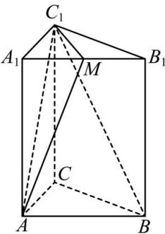

<!-- question-source:start -->
【13】(2023·江苏高二专题练习)如图,已知正三棱柱 $ABC-A_{1}B_{1}C_{1}$ 的底面边长为a,侧棱长为 $\sqrt{2}a$ ,M为 $A_{1}B_{1}$ 的中点,求 $BC_{1}$ 与平面 $AMC_{1}$ 所成角的正弦值.

<!-- question-source:end -->

![[Q00005566A1]]
