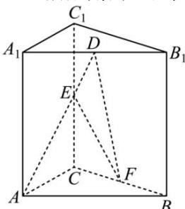
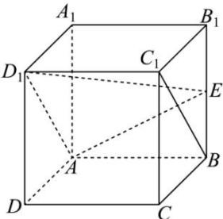

<!-- question-source:start -->
【14】(2023·全国高三专题练习)如图所示,在直棱柱 $ABC-A_{1}B_{1}C_{1}$ 中, $AA_{1}=AB=AC=2$ , $\angle BAC=\frac{\pi}{2}$ , D,E,F 分别是 $A_{1}B_{1}$ , $CC_{1}$ , BC 的中点. 求 AE 与平面 DEF 所成角的正弦值.

<!-- question-source:end -->

![[Q00005567A1]]
