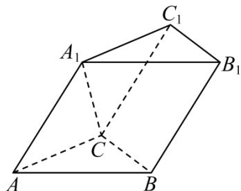

<!-- question-source:start -->
【16】（2024·重庆高三阶段练习）如图, 斜三棱柱 $ABC - A_{1}B_{1}C_{1}$ 中, 底面 $\triangle ABC$ 是边长为 a 的正三角形, 侧面 $ABB_{1}A_{1}$ 为菱形, 且 $\angle A_{1}AB = 60^{\circ}$ .
（1）求证： $AB \perp A_{1}C$ ;
(2) 若 $\cos\angle A_{1}AC=\frac{1}{4}$ ，三棱柱 $ABC-A_{1}B_{1}C_{1}$ 的体积为 24，求直线 $A_{1}C$ 与平面 $CBB_{1}C_{1}$ 所成角的正弦值.

<!-- question-source:end -->

![[Q00005647A1]]
