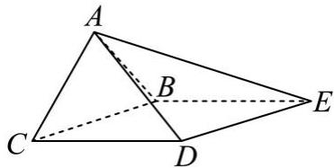

<!-- question-source:start -->
【19】（2024·山东高二期中）如图, 四棱锥 A-BCDE 中, 侧面 ABC 为等边三角形, 底面 BCDE 为菱形, $\angle BCD=\frac{\pi}{3}, BC=2, AD=\sqrt{6}.$ （1）设平面 ABC 与 ADE 的交线为 l，求证： $l//BC$ ;
（2）若点 F 在棱 DE 上，且直线 AF 与平面 ABD 所成角的正弦值为 $\frac{\sqrt{15}}{25}$ ，求 DF.

<!-- question-source:end -->

![[Q00005650A1]]
