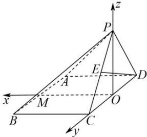

> [!faq]- 全练一本通解析
> **【答案】** $\frac{1}{2}$
>
> **【解析】**
> 取 CD 中点为 O, AB 中点为 M, 连接 OP, OM, 因为 $\triangle PCD$ 是等边三角形， $O$ 为 $CD$ 中点，所以 $OP \perp CD$ ，因为平面 $PCD \perp$ 底面 $ABCD$ ，平面 $PCD \cap$ 底面 $ABCD = CD$ ， $OP \subset$ 平面 $PCD$ ，所以 $OP \perp$ 平面 $ABCD$ ，又 $OM, OC \subset$ 平面 $ABCD$ ，则 $OP \perp OM, OP \perp OC$ ，如图，以 $O$ 为原点， $OM, OC, OP$ 分别为 $x, y, z$ 轴建立空间直角坐标系，
> 
> 又 $V_{P - ABCD} = \frac{1}{3} AD\cdot DC\cdot OP = \frac{1}{3}\times 3\cdot DC\cdot \frac{\sqrt{3}}{2} DC = 18\sqrt{3}$ ，所以 $\left|DC\right| = 6$ 则 $A(3, - 3,0),C(0,3,0),D(0, - 3,0),P(0,0,3\sqrt{3}),E\left(0,\frac{3}{2},\frac{3\sqrt{3}}{2}\right)$ ，所以 $\overrightarrow{DE} = \left(0,\frac{9}{2},\frac{3\sqrt{3}}{2}\right)$ 设平面PAD的法向量为 $\vec{n} = (x,y,z)$ ，又 $\overrightarrow{DA} = (3,0,0),\overrightarrow{DP} = (0,3,3\sqrt{3})$ 则 $\left\{\overrightarrow{DA}\cdot \vec{n} = 0\right.\Rightarrow \left\{ \begin{array}{l}3x = 0\\ \overrightarrow{DP}\cdot \vec{n} = 0 \end{array} \right.\Rightarrow \left\{ \begin{array}{l}x = 0\\ y = -\sqrt{3} z \end{array} \right.$ ，令 $z = 1$ ，则 $\vec{n} = (0, - \sqrt{3},1)$ 所以 $\cos \vec{n},\overrightarrow{DE} = \frac{\vec{n}\cdot\overrightarrow{DE}}{|\vec{n}|\cdot|\overrightarrow{DE}|} = \frac{-\frac{9\sqrt{3}}{2} + \frac{3\sqrt{3}}{2}}{2\times 3\sqrt{3}} = -\frac{1}{2}$ ，则直线 $DE$ 与平面PAD所成角的正弦值是 $\frac{1}{2}$
