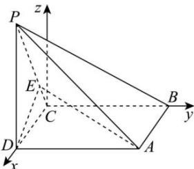

> [!faq]- 全练一本通解析
> **【答案】** $\frac{3\sqrt{10}}{10}$
>
> **【解析】**
> 由 ABCD 为矩形可知: $BC \perp CD$ , 又因为 $BC \perp DE, DE \cap CD = D,$ CD, DE ⊂ 平面 PCD, 所以 BC ⊥ 平面 PCD, 可知 $BC \perp PC, BC = AD = 2,$ PB = 3, 所以 $PC = \sqrt{5}$ , 在 $\triangle PCD$ 中, $PC^{2}=PD^{2}+CD^{2}$ , 所以 $PD \perp CD$ ;
> 又 $PD \perp AD, CD \cap AD = D, CD, AD \subset$ 面 ABCD, 所以 $PD \perp$ 面 ABCD;
> 故以点 C 为坐标原点, 建立空间直角坐标系 C-xyz （如图）.
> 
> 则 $C(0,0,0)$ ， $B(0,2,0)$ ， $A(1,2,0)$ ， $D(1,0,0)$ ， $P(1,0,2)$ ，
> 又在 $\triangle PCD$ 中， $\frac{PE}{CE}=2$ ，则 $E\left(\frac{1}{3},0,\frac{2}{3}\right),\overrightarrow{DE}=\left(-\frac{2}{3},0,\frac{2}{3}\right),\overrightarrow{CP}=(1,0,2),\overrightarrow{CB}=(0,2,0)$ .
> 设面 PBC 的法向量 $\vec{n}=(x,y,z)$ ，则 $\left\{\begin{aligned}\overrightarrow{CB}\cdot\vec{n}&=0\\ \overrightarrow{CP}\cdot\vec{n}&=0\end{aligned}\right.$ ，即 $\left\{\begin{aligned}2y&=0,\\ x&+2z=0,\end{aligned}\right.$ 故 $\vec{n}=(-2,0,1)$ ，
> 设直线 DE 与面 PBC 所成角为 $\theta$ ，
> 则 $\sin\theta=\left|\cos\overrightarrow{DE},\vec{n}\right|=\frac{\frac{4}{3}+\frac{2}{3}}{\frac{2}{3}\sqrt{2}\times\sqrt{5}}=\frac{3\sqrt{10}}{10}$ .
> 故直线 DE 与平面 PBC 所成角的正弦值为： $\frac{3\sqrt{10}}{10}$ .
