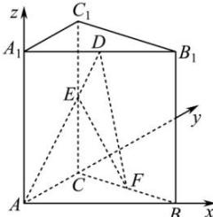

> [!faq]- 全练一本通解析
> **【答案】** $\frac{\sqrt{70}}{14}$
>
> **【解析】**
> 因为三棱柱 ABC- $A_{1}B_{1}C_{1}$ 是直三棱柱，
> 所以 $AA_{1}\perp$ 面 ABC，又 AB, AC⊂面 ABC，故 $AA_{1}\perp AB$ , $AA_{1}\perp AC$ 因为 $\angle BAC = \frac{\pi}{2}$ ，所以 $AB \perp AC$ ，则 $AA_{1}, AC, AB$ 两两垂直，
> 故以 A 为原点，建立空间直角坐标系，如图，
> 
> 则 $A(0,0,0), E(0,2,1), F(1,1,0), D(1,0,2)$ 故 $\overrightarrow{AE} = (0,2,1), \overrightarrow{DF} = (0,1,-2), \overrightarrow{DE} = (-1,2,-1)$ 设平面DEF的一个法向量为 $\vec{m} = (x,y,z)$ ，则 $\left\{\frac{\overrightarrow{DF}\cdot\vec{m}=y-2z=0}{\overrightarrow{DE}\cdot\vec{m}=-x+2y-z=0}\right.$ 令 $z=1$ ，则 $y=2, x=3$ ，故 $\vec{m} = (3,2,1)$ ，设AE与平面DEF所成角为 $\theta$ ，则 $\sin\theta = \left|\cos\left\langle\overrightarrow{AE},\vec{m}\right\rangle\right| = \frac{\left|\overrightarrow{AE}\cdot\vec{m}\right|}{\left|\overrightarrow{AE}\right|\left|\vec{m}\right|} = \frac{\left|4+1\right|}{\sqrt{5}\times\sqrt{14}} = \frac{\sqrt{70}}{14}$ ，所以AE与平面DEF所成角的正弦值为 $\frac{\sqrt{70}}{14}$ 。
