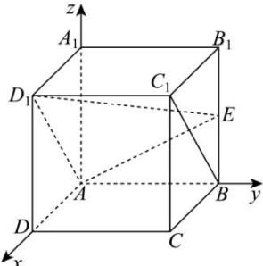

> [!faq]- 全练一本通解析
> **【答案】** （1）证明见解析（2） $\frac{\sqrt{5}}{3}$
>
> **【解析】**
> （1）如图建立空间直角坐标系，则 $A(0,0,0), D_1(2,0,2), E(0,2,1), B(0,2,0), C_1(2,2,2), A_1(0,0,2)$ ，
> 所以 $\overrightarrow{AD_{1}}=(2,0,2)$ ， $\overrightarrow{AE}=(0,2,1)$ ， $\overrightarrow{BC_{1}}=(2,0,2)$ ，
> 设平面 $AD_{1}E$ 的法向量为 $\vec{n}=(x,y,z)$ ，则 $\left\{\begin{aligned}\vec{n}\cdot\overrightarrow{AD_{1}}&=2x+2z=0\\\vec{n}\cdot\overrightarrow{AE}&=2y+z=0\end{aligned}\right.$ 取 $\vec{n}=(2,1,-2)$ 所以 $\vec{n}\cdot\overrightarrow{BC_{1}}=2\times2+1\times0+\left(-2\right)\times2=0$ 所以 $\vec{n} \perp \overrightarrow{BC_{1}}$ ，又 $BC_{1} \not\subset$ 平面 $AD_{1}E$ ，所以 $BC_{1} //$ 平面 $AD_{1}E$ 。
> 
> （2）由（1）可知 $AA_{1}=(0,0,2)$ ，
> 设直线 $AA_{1}$ 与平面 $AD_{1}E$ 所成角为 $\theta$ ，则 $\sin\theta=\frac{\left|\overrightarrow{AA_{1}}\cdot\vec{n}\right|}{\left|\overrightarrow{AA_{1}}\right|\cdot\left|\vec{n}\right|}=\frac{4}{2\times3}=\frac{2}{3}$ ，
> 所以 $\cos\theta=\sqrt{1-\sin^{2}\theta}=\frac{\sqrt{5}}{3}$ ，即直线 $AA_{1}$ 与平面 $AD_{1}E$ 所成角的余弦值为 $\frac{\sqrt{5}}{3}$ .
