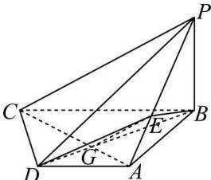
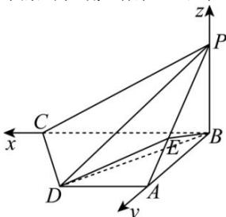

> [!faq]- 全练一本通解析
> **【答案】** （1）证明见解析（2） $\frac{\sqrt{7}}{3}$
>
> **【解析】**
> （1）∵ $PB \perp$ 底面 ABCD, $CD \subset$ 底面 ABCD, ∴ $PB \perp CD$ ,
> ∵ $PD \perp CD$ , $PB \cap PD = P$ , PB, $PD \subset$ 平面 PBD, ∴ $CD \perp$ 平面 PBD,
> ∵ $BD \subset$ 平面 PBD, ∴ $BD \perp CD$ ,
> ∵底面ABCD为直角梯形，AD//BC，AB⊥BC，AB=AD=1，
> ∴在直角三角形ABD中， $BD=\sqrt{AB^{2}+AD^{2}}=\sqrt{2}$ ， $\angle ABD=\frac{\pi}{4}$ 在直角三角形CBD中， $\angle CBD=\frac{\pi}{4}$ ， $BC=\frac{BD}{\cos\frac{\pi}{4}}=2$
> 
> 设 $AC \cap BD = G$ ，连接 AC, EG，则 $\triangle CBG \sim \triangle ADG$ ， $\therefore \frac{AG}{GC} = \frac{AD}{BC} = \frac{1}{2} = \frac{AE}{EP}, \therefore PC \parallel EG$ 又 $EG \subset$ 平面 EBD, $PC \not\subset$ 平面 EBD, $\therefore PC \parallel$ 平面 EBD;
> (2)∵PB⊥底面ABCD, BC, BA⊂底面ABCD, ∴ PB⊥BC, PB⊥BA,
> ∵底面ABCD为直角梯形, ∴ AB⊥BC
> 以 B 为坐标原点, BC, BA, BP 所在直线分别为 x 轴, y 轴, z 轴建立如图所示的空间直角坐标系 B-xyz，
> 
> 则 $P(0,0,1)$ ， $A(0,1,0)$ ， $D(1,1,0)$ ， $\therefore \overrightarrow{BP} = (0,0,1)$ ， $\overrightarrow{PA} = (0,1,-1)$ ， $\overrightarrow{BD} = (1,1,0)$ ， $\therefore \overrightarrow{BE} = \overrightarrow{BP} + \overrightarrow{PE} = \overrightarrow{BP} + \frac{3}{2}\overrightarrow{PA} = \left(0, \frac{2}{3}, \frac{1}{3}\right)$ ，
> 设平面 $EBD$ 的一个法向量为 $\vec{n} = (x,y,z)$ ， $\therefore \begin{cases} \vec{n} \cdot \overrightarrow{BE} = \frac{2}{3}y + \frac{1}{3}z = 0 \\ \vec{n} \cdot \overrightarrow{BD} = x + y = 0 \end{cases}$ ，
> 取 $z = 2$ ，则 $x = 1$ ， $y = -1$ ，
> 则平面 $EBD$ 的一个法向量为 $\vec{n} = (1,-1,2)$ ，
> 设直线 $PD$ 与平面 $EBD$ 所成角大小为 $\theta$ ， $\theta \in \left[0, \frac{\pi}{2}\right]$ ， $\because \overrightarrow{PD} = (1,1,-1)$ ， $\therefore \sin \theta = |\cos < \overrightarrow{PD}, \vec{n}>| = \frac{|\overrightarrow{PD} \cdot \vec{n}|}{|\overrightarrow{PD}| \cdot |\vec{n}|} = \frac{|-2|}{\sqrt{6} \times \sqrt{3}} = \frac{\sqrt{2}}{3}$ ，
> 得 $\cos \theta = \sqrt{1 - \sin^2 \theta} = \frac{\sqrt{7}}{3}$ ，
> 故直线 $PD$ 与平面 $EBD$ 所成角的余弦值为 $\frac{\sqrt{7}}{3}$ 。
