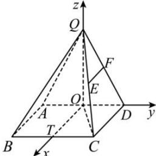

> [!faq]- 全练一本通解析
> **【答案】** （1）证明见解析；（2） $\left[\frac{\sqrt{3}}{4}, \frac{\sqrt{39}}{13}\right]$
>
> **【解析】**
> （1）在 $\triangle QCD$ 中， $QC = \sqrt{5}$ ， $CD = 1$ ， $QD = 2$ ， $\therefore QC^2 = QD^2 + CD^2$ ， $\therefore \triangle QCD$ 为直角三角形且 $CD \perp QD$ ，
> 又底面 $ABCD$ 是矩形，则 $CD \perp AD$ ， $\because QD \cap AD = D$ ，且均含于面 $QAD$ 内 $\therefore CD \perp$ 平面 $QAD$ ，
> 又 $\because CD \subset$ 平面 $ABCD$ ， $\therefore$ 平面 $QAD \perp$ 平面 $ABCD$ ；
> （2）在平面 $ABCD$ 内，取 $AD$ 中点为 $O$ ，过点 $O$ 作 $OT // CD$ ，交 $BC$ 于点 $T$ ， $\because CD \perp AD$ ， $\therefore OT \perp AD$ ，
> 由题意可得 $QO \perp$ 平面 $ABCD$ ，且 $OT, AD \subset$ 平面 $ABCD$ ，
> 则 $OQ \perp AD, OQ \perp OT$ ，∴ 直线 OQ, OT, OD 两两互相垂直，
> 
> ∴ 以 O 为坐标原点, OT, OD, OQ 所在直线分别为 x, y, z 轴建如图所示的空间直角坐标系,
> 则 $D(0,1,0)$ ， $Q(0,0,\sqrt{3})$ ， $B(1,-1,0)$ ， $C(1,1,0)$ ， $E(\frac{1}{2},\frac{1}{2},\frac{\sqrt{3}}{2})$ ，
> ∴ $\overrightarrow{CD} = (-1, 0, 0)$ ， $\overline{BE} = (-\frac{1}{2}, \frac{3}{2}, \frac{\sqrt{3}}{2})$ 设 $\overrightarrow{EP} = \lambda \overrightarrow{EF} (0 \leq \lambda \leq 1)$ 则 $\overrightarrow{EP}=\frac{\lambda}{2}\overrightarrow{CD}=(-\frac{\lambda}{2},0,0)$ ， $\overrightarrow{BP}=\overrightarrow{BE}+\overrightarrow{EP}=(-\frac{1}{2}-\frac{\lambda}{2},\frac{3}{2},\frac{\sqrt{3}}{2})$ 又 $\overrightarrow{OQ}=(0,0,\sqrt{3})$ 则 $\sin\theta=\frac{|\overrightarrow{BP}\cdot\overrightarrow{OQ}|}{|BP||\overrightarrow{OQ}|}=\frac{\sqrt{3}}{\sqrt{(\lambda+1)^{2}+12}}$ ∵ $\lambda \in [0,1]$ ， $\frac{\sqrt{3}}{4} \leq \sin\theta \leq \frac{\sqrt{39}}{13}$ ∴ BP 与平面 ABCD 所成角的正弦值的取值范围为 $\left[\frac{\sqrt{3}}{4},\frac{\sqrt{39}}{13}\right]$ .
