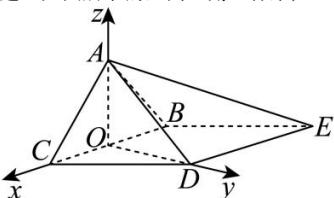

> [!faq]- 全练一本通解析
> **【答案】** （1）证明见解析（2） $DF = \frac{1}{2}$
>
> **【解析】**
> （1）因为底面BCDE是菱形，
> 所以 $BC / / DE$ ，
> 因为 $BC\notin$ 平面ADE， $DE\subset$ 平面ADE
> 所以 $BC\parallel$ 平面ADE，
> 因为平面ABC与平面ADE的交线为 $l$ ，且 $BC\subset$ 平面ABC，
> 所以 $l / / BC$ （2）取BC中点 $O$ ，连接 $AO$ ，DO，则 $AO = DO = \sqrt{3}$ ，
> 所以 $AO^2 +DO^2 = AD^2$ ，
> 所以 $AO\bot DO$ ，
> 因为侧面ABC为等边三角形，
> 所以 $AO\bot BC$ ，
> 因为 $BC\cap OD = O$ ，且 $BC\subset$ 平面BCDE， $OD\subset$ 平面BCDE，
> 所以 $AO\bot$ 平面BCDE，
> 以点 $O$ 为坐标原点，OC，OD，OA所在直线分别为 $x$ 轴、y轴、z轴，
> 建立如图所示的空间直角坐标系，
> 
> 则 $A(0,0,\sqrt{3})$ ， $B(-1,0,0)$ ， $D(0,\sqrt{3},0)$ ， $E(-2,\sqrt{3},0)$ ，
> 则 $\overrightarrow{AB}=(-1,0,-\sqrt{3})$ ， $\overrightarrow{AD}=(0,\sqrt{3},-\sqrt{3})$ ， $\overrightarrow{DE}=(-2,0,0)$ 设平面 ABD 的法向量为 $\vec{n}=(x,y,z)$ ，则 $\left\{\begin{aligned}\vec{n}\cdot\overrightarrow{AB}&=0\\ \vec{n}\cdot\overrightarrow{AD}&=0\end{aligned}\right.\Rightarrow\left\{\begin{aligned}-x-\sqrt{3}z&=0\\ \sqrt{3}y-\sqrt{3}z&=0\end{aligned}\right.$ 令 z=1， $x=-\sqrt{3},y=1$ ，所以 $\vec{n}=(-\sqrt{3},1,1)$ ，
> 设 $\overrightarrow{DF}=\lambda\overrightarrow{DE}(0\leq\lambda\leq1)$ ，其中 $F(x_{0},y_{0},z_{0})$ ，
> 则 $\left(x_{0},y_{0}-\sqrt{3},z_{0}\right)=\lambda(-2,0,0)=(-2\lambda,0,0)$ ，
> 所以 $F(-2\lambda,\sqrt{3},0)$ ，所以 $\overrightarrow{AF}=(-2\lambda,\sqrt{3},-\sqrt{3})$ ，
> 因为直线 AF 与平面 ABD 所成角的正弦值为 $\frac{\sqrt{15}}{25}$ ，
> 所以 $\left|\cos<\overrightarrow{AF},\vec{n}\right|=\frac{\left|\overrightarrow{AF}\cdot\vec{n}\right|}{\left|\overrightarrow{AF}\right|\cdot\left|\vec{n}\right|}=\frac{2\sqrt{3}\lambda}{\sqrt{5}\cdot\sqrt{4\lambda^{2}+6}}=\frac{\sqrt{15}}{25}$ ，解得 $\lambda=\frac{1}{4}$ 所以 $\left|\overrightarrow{DF}\right|=\frac{1}{4}\left|\overrightarrow{DE}\right|=\frac{1}{2}$ ，即 $DF=\frac{1}{2}$ .
