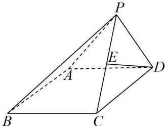

## 题型 2: 求空间线面夹角

![[高中/课堂同步/题库/高中数学全练一本通/空间向量与立体几何/第七节_向量法求空间夹角/重点题型专练/题型_2__求空间线面夹角/questions/Q00005564.md]]
![[高中/课堂同步/题库/高中数学全练一本通/空间向量与立体几何/第七节_向量法求空间夹角/重点题型专练/题型_2__求空间线面夹角/questions/Q00005565.md]]
![[高中/课堂同步/题库/高中数学全练一本通/空间向量与立体几何/第七节_向量法求空间夹角/重点题型专练/题型_2__求空间线面夹角/questions/Q00005566.md]]
![[高中/课堂同步/题库/高中数学全练一本通/空间向量与立体几何/第七节_向量法求空间夹角/重点题型专练/题型_2__求空间线面夹角/questions/Q00005567.md]]
![[高中/课堂同步/题库/高中数学全练一本通/空间向量与立体几何/第七节_向量法求空间夹角/重点题型专练/题型_2__求空间线面夹角/questions/Q00005568.md]]
![[高中/课堂同步/题库/高中数学全练一本通/空间向量与立体几何/第七节_向量法求空间夹角/重点题型专练/题型_2__求空间线面夹角/questions/Q00005647.md]]
![[高中/课堂同步/题库/高中数学全练一本通/空间向量与立体几何/第七节_向量法求空间夹角/重点题型专练/题型_2__求空间线面夹角/questions/Q00005648.md]]
![[高中/课堂同步/题库/高中数学全练一本通/空间向量与立体几何/第七节_向量法求空间夹角/重点题型专练/题型_2__求空间线面夹角/questions/Q00005649.md]]
![[高中/课堂同步/题库/高中数学全练一本通/空间向量与立体几何/第七节_向量法求空间夹角/重点题型专练/题型_2__求空间线面夹角/questions/Q00005650.md]]
![[高中/课堂同步/题库/高中数学全练一本通/空间向量与立体几何/第七节_向量法求空间夹角/重点题型专练/题型_2__求空间线面夹角/questions/Q00005651.md]]
