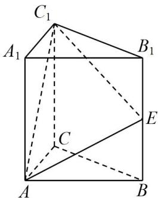

<!-- question-source:start -->
【23】（2023·广东湛江高三上阶段练习）如图，在直三棱柱 $ABC-A_{1}B_{1}C_{1}$ 中， $AC \perp BC, E$ 为 $BB_{1}$ 的中点， $AB = CC_{1} = 2BC = 2$ .
（1）证明： $AC \perp C_{1}E$ .
（2）求二面角 $A - EC_{1} - B$ 的余弦值.

<!-- question-source:end -->

![[Q00005653A1]]
