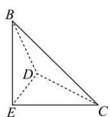
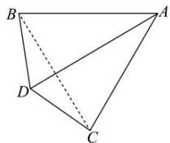
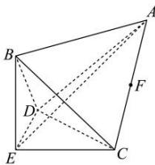

<!-- question-source:start -->
【27】(23-24 高二上·安徽·阶段练习) 如图, 现有三棱锥 A-BCD 和 E-BCD, 其中三棱锥 A-BCD 的棱长均为 2, 三棱锥 E-BCD 有三个面是全等的等腰直角三角形, 一个面是等边三角形, 现将这两个三棱锥的一个面完全重合组成一个组合体 ABCDE.

（1）求这个组合体 ABCDE 的体积；

（2）若点 F 为 AC 的中点, 求二面角 E - BC - F 的余弦值.
<!-- question-source:end -->

![[Q00005657A1]]
