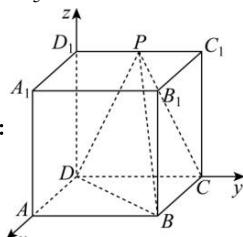

> [!faq]- 全练一本通解析
> **【答案】** $\frac{\sqrt{5}}{5}$
>
> **【解析】**
> 
> ∵ 四边形 $CDD_{1}C_{1}$ 是平行四边形, 又点 P 为 $D_{1}C_{1}$ 的中点, 且 PD = PC
> ∴ $\triangle DD_{1}P \cong \triangle CC_{1}P$ , ∴ $\angle DD_{1}P = \angle CC_{1}P$ ,
> 又 $\angle DD_{1}P + \angle CC_{1}P = 180^{\circ}$ ， $\therefore \angle DD_{1}P = \angle CC_{1}P = 90^{\circ}$ $\therefore DD_{1}\bot D_{1}C_{1},\therefore DD_{1}\bot DC$ $\because$ 侧面 $ADD_{1}A_{1}$ 是矩形， $\therefore DD_1\bot AD$ 又四边形ABCD是正方形，可知AD,CD, $DD_{1}$ 两两相互垂直，以 $D$ 为原点建立如图所示空间直角坐标系， $D(0,0,0),P(0,1,2),B(2,2,0),C(0,2,0)$ $\overrightarrow{DP} = (0,1,2),\overrightarrow{DB} = (2,2,0),\overrightarrow{CB} = (2,0,0),\overrightarrow{CP} = (0,-1,2)$ 设平面DPB的法向量为 $\vec{m} = (x,y,z)$ 则 $\left\{ \begin{array}{l}\vec{m}\cdot \overrightarrow{DP} = y + 2z = 0\\ \vec{m}\cdot \overrightarrow{DB} = 2x + 2y = 0 \end{array} \right.$ 故可设 $\vec{m} = (2, - 2,1)$ 设平面CPB的法向量为 $\vec{n} = (a,b,c)$ 则 $\left\{ \begin{array}{l}\vec{n}\cdot \overrightarrow{CB} = 2a = 0\\ \vec{n}\cdot \overrightarrow{CP} = -b + 2c = 0 \end{array} \right.$ 故可设 $\vec{n} = (0,2,1)$ 设平面CPB与平面DPB的夹角为 $\theta$ 则 $\cos \theta = \left|\frac{\vec{m}\cdot\vec{n}}{\left|\vec{m}\right|\cdot\left|\vec{n}\right|}\right| = \frac{3}{3\times\sqrt{5}} = \frac{\sqrt{5}}{5}$
